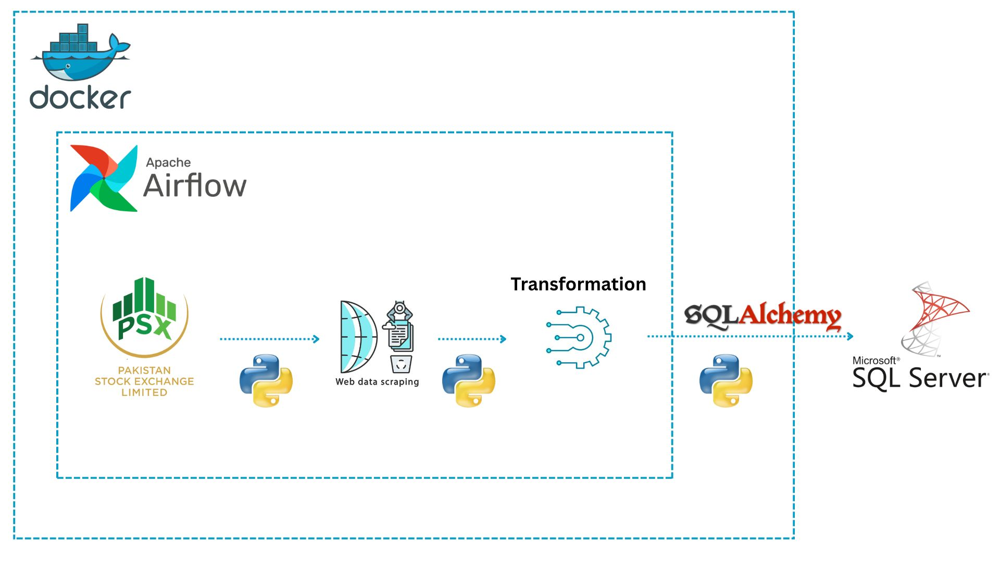

# PSX Data Pipeline Using Airflow, Docker, and SQL Server



## 📌 Project Overview

This project automates the extraction, transformation, and loading (ETL) of stock market data from the **Pakistan Stock Exchange (PSX)** into a **Microsoft SQL Server** database using the following technologies:

- **Python**: For web scraping and data processing.
- **Apache Airflow**: To orchestrate and schedule ETL tasks.
- **SQLAlchemy**: To interface with the SQL Server database.
- **Docker**: To containerize and manage the entire workflow.

---

## ⚙️ Workflow

1. **Web Scraping**  
   Python scripts scrape stock data from the PSX website.

2. **Data Transformation**  
   The raw data is cleaned and transformed into a structured format using Python.

3. **Load to Database**  
   The transformed data is inserted into a Microsoft SQL Server database using SQLAlchemy.

4. **Orchestration with Airflow**  
   All steps are orchestrated using Airflow DAGs, ensuring automation and scheduling.

5. **Containerization with Docker**  
   Docker containers encapsulate the environment for consistent deployment.

---

## 🛠 Technologies Used

| Tool | Purpose |
|------|---------|
|  | Scripting and ETL |
|  | Task Orchestration |
|  | Database Connectivity |
|  | Data Storage |
|  | Containerization |

---

## 🚀 How to Run the Project

### Prerequisites

- Docker and Docker Compose
- Python 3.8+
- Microsoft SQL Server (local or remote)

### Steps

1. **Clone the repository**
   ```bash
   git clone https://github.com/yourusername/psx-etl-pipeline.git
   cd psx-etl-pipeline
